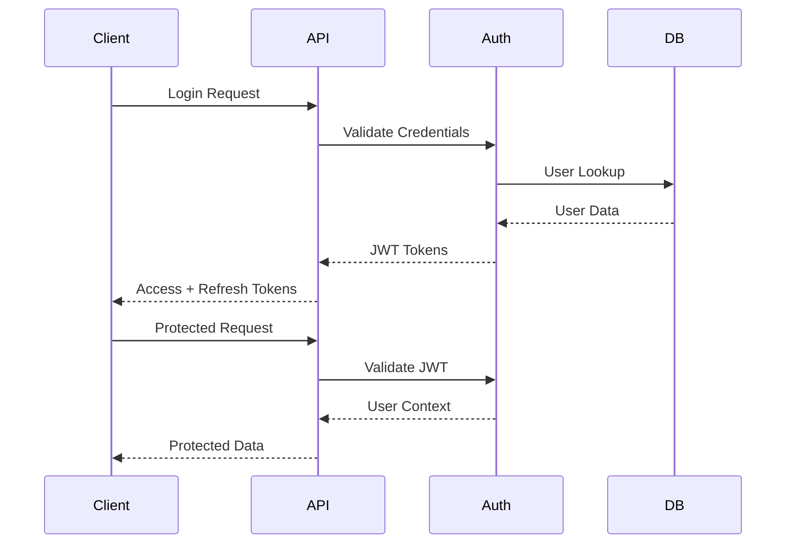

# PlanMorph Technical Architecture Guide

## 🏗️ System Architecture Overview

PlanMorph is built using a modern, microservices-inspired architecture designed for enterprise scalability. The application follows clean architecture principles with clear separation of concerns.

## 🔧 Backend Architecture (Node.js/Express)

### Directory Structure Analysis

```
backend/src/
├── app.ts              # Express application configuration
├── server.ts           # Server entry point with clustering
├── config/             # Configuration management
├── controllers/        # HTTP request handlers (Presentation Layer)
├── services/           # Business logic (Application Layer)
├── middleware/         # Cross-cutting concerns
├── routes/             # API route definitions
├── types/              # TypeScript type definitions
├── utils/              # Utility functions
└── scripts/            # Database operations
```

### Core Components

#### 1. Application Bootstrap (`app.ts`)
```typescript
// Security-first approach with comprehensive middleware stack
app.use(helmet({
  contentSecurityPolicy: {
    directives: {
      defaultSrc: ["'self'"],
      styleSrc: ["'self'", "'unsafe-inline'"],
      scriptSrc: ["'self'"],
      imgSrc: ["'self'", "data:", "https:"],
    },
  },
  crossOriginEmbedderPolicy: false,
}));

// Rate limiting for DDoS protection
const limiter = rateLimit({
  windowMs: config.rateLimit.windowMs,
  max: config.rateLimit.maxRequests,
  message: {
    success: false,
    error: 'Too many requests from this IP, please try again later.',
  },
});
```

#### 2. Configuration Management (`config/index.ts`)
- **Environment-based configuration**: Development, staging, production
- **Database connection pooling**: Optimized for high concurrency
- **JWT token management**: Secure authentication setup
- **External service integration**: Supabase, Redis, Stripe

#### 3. Database Layer (`config/database.ts`)
```typescript
// PostgreSQL client with enhanced configuration
export const query = async (text: string, params?: any[]): Promise<any> => {
  const start = Date.now();
  let client: PoolClient | undefined;
  
  try {
    client = await pool.connect();
    const result = await client.query(text, params);
    const duration = Date.now() - start;
    
    logger.debug('Executed query', {
      text: text.substring(0, 100) + (text.length > 100 ? '...' : ''),
      duration: `${duration}ms`,
      rows: result.rowCount
    });
    
    return result;
  } catch (error) {
    const duration = Date.now() - start;
    logger.error('Database query error:', {
      text: text.substring(0, 100) + (text.length > 100 ? '...' : ''),
      duration: `${duration}ms`,
      error: error instanceof Error ? error.message : String(error)
    });
    throw error;
  } finally {
    if (client) {
      client.release();
    }
  }
};
```

#### 4. Caching Strategy (`config/cache.ts`)
- **Redis clustering support**: High availability caching
- **Event-driven cache management**: Automatic invalidation
- **Memory-efficient operations**: Optimized data structures

### API Design Patterns

#### 1. Controller Pattern
Controllers handle HTTP requests and delegate business logic to services:

```typescript
// Example from plansController.ts
export const getAllPlans = asyncHandler(async (req: Request, res: Response) => {
  const { page, limit, offset } = getPaginationParams(
    req.query.page as string,
    req.query.limit as string
  );
  
  // Business logic delegation to service layer
  const plans = await planService.getPlans({
    page,
    limit,
    filters: req.query
  });
  
  return sendPaginatedResponse(res, plans, page, limit);
});
```

#### 2. Middleware Architecture
- **Authentication middleware**: JWT verification and user context
- **Validation middleware**: Input sanitization using express-validator
- **Error handling**: Centralized error processing with structured responses

#### 3. Database Query Patterns
The schema uses advanced PostgreSQL features:

```sql
-- Full-text search optimization
CREATE INDEX idx_house_plans_title_search 
ON house_plans USING GIN(to_tsvector('english', title));

-- Composite indexes for performance
CREATE INDEX idx_house_plans_category_popularity 
ON house_plans(category_id, popularity_score DESC);

-- Partial indexes for active records
CREATE INDEX idx_categories_active 
ON categories(name) WHERE is_active = true;
```

## 🎨 Frontend Architecture (Next.js 15)

### App Router Structure
```
frontend/src/app/
├── layout.tsx          # Root layout with providers
├── page.tsx           # Homepage
├── auth/              # Authentication flow
├── plans/             # Plan browsing & details
│   ├── page.tsx       # Plans listing
│   └── [slug]/        # Dynamic plan details
├── cart/              # Shopping cart
├── categories/        # Plan categories
├── architects/        # Architect profiles
├── 3d-tours/         # 3D visualization
└── pricing/          # Pricing information
```

### Component Architecture

#### 1. Atomic Design Principles
```
components/
├── atoms/              # Basic UI elements
│   ├── LoadingSpinner.tsx
│   └── OptimizedImage.tsx
├── molecules/          # Component combinations
│   ├── PlanCard.tsx
│   └── SearchAndFilter.tsx
├── organisms/          # Complex UI sections
│   ├── Navigation.tsx
│   ├── HeroSection.tsx
│   ├── PlanGrid.tsx
│   └── Footer.tsx
└── templates/          # Page layouts
```

#### 2. State Management Pattern
```typescript
// Context-based state management
interface AuthContextType {
  user: User | null;
  tokens: AuthTokens | null;
  isLoading: boolean;
  isAuthenticated: boolean;
  login: (credentials: LoginCredentials) => Promise<void>;
  register: (data: RegisterData) => Promise<void>;
  logout: () => void;
  updateProfile: (data: UserProfile) => Promise<void>;
  refreshToken: () => Promise<void>;
}
```

#### 3. Custom Hooks Pattern
```typescript
// usePlans.ts - Data fetching hook
export const usePlans = (filters?: PlanFilters) => {
  const [plans, setPlans] = useState<Plan[]>([]);
  const [loading, setLoading] = useState(true);
  const [error, setError] = useState<string | null>(null);

  useEffect(() => {
    const fetchPlans = async () => {
      try {
        const response = await apiClient.get('/plans', { params: filters });
        setPlans(response.data);
      } catch (err) {
        setError('Failed to fetch plans');
      } finally {
        setLoading(false);
      }
    };

    fetchPlans();
  }, [filters]);

  return { plans, loading, error };
};
```

### API Client Architecture

#### 1. HTTP Client with Resilience Patterns
```typescript
// api-client.ts - Enhanced HTTP client
class ApiClient {
  private circuitBreaker: CircuitBreaker;
  private retryCount = 3;
  private timeout = 10000;

  async request(config: RequestConfig) {
    return this.circuitBreaker.execute(async () => {
      return await this.httpClient.request(config);
    });
  }

  // Batch request capabilities
  async batchRequest(requests: RequestConfig[]) {
    return Promise.allSettled(
      requests.map(request => this.request(request))
    );
  }
}
```

## 🗄️ Database Design Deep Dive

### Schema Architecture

#### 1. Core Entity Design
```sql
-- Main house plans table with performance optimization
CREATE TABLE house_plans (
    id UUID PRIMARY KEY DEFAULT gen_random_uuid(),
    
    -- Basic information
    title VARCHAR(200) NOT NULL,
    description TEXT,
    seo_slug VARCHAR(200) NOT NULL UNIQUE,
    
    -- Classification with foreign keys
    category_id UUID NOT NULL REFERENCES categories(id),
    subcategory_id UUID REFERENCES subcategories(id),
    
    -- Specifications with constraints
    bedrooms INTEGER NOT NULL CHECK (bedrooms >= 0),
    bathrooms DECIMAL(3,1) NOT NULL CHECK (bathrooms >= 0),
    square_footage INTEGER NOT NULL CHECK (square_footage > 0),
    
    -- Pricing strategy
    price_tier VARCHAR(20) DEFAULT 'standard' 
      CHECK (price_tier IN ('free', 'standard', 'premium', 'exclusive')),
    base_price DECIMAL(10,2) DEFAULT 0,
    
    -- Performance optimization fields
    view_count INTEGER DEFAULT 0,
    download_count INTEGER DEFAULT 0,
    favorite_count INTEGER DEFAULT 0,
    popularity_score DECIMAL(5,2) DEFAULT 0,
    
    -- Search optimization
    search_keywords TEXT[], -- PostgreSQL array for flexibility
    
    -- Timestamps
    created_at TIMESTAMP WITH TIME ZONE DEFAULT NOW(),
    updated_at TIMESTAMP WITH TIME ZONE DEFAULT NOW(),
    published_at TIMESTAMP WITH TIME ZONE
);
```

#### 2. Relationship Design
- **One-to-Many**: Plans → Images, Plans → Files
- **Many-to-Many**: Users → Favorites (through user_favorites)
- **Hierarchical**: Categories → Subcategories

#### 3. Performance Optimization
```sql
-- Strategic indexing for common query patterns
CREATE INDEX idx_house_plans_category_popularity 
ON house_plans(category_id, popularity_score DESC);

-- Full-text search capabilities
CREATE INDEX idx_house_plans_search_keywords 
ON house_plans USING GIN(search_keywords);

-- Composite index for specifications search
CREATE INDEX idx_house_plans_specs_search 
ON house_plans(bedrooms, bathrooms, square_footage);
```

### Query Optimization Patterns

#### 1. Pagination with Performance
```sql
-- Efficient pagination with cursor-based approach
SELECT * FROM house_plans 
WHERE created_at < $cursor
ORDER BY created_at DESC, id DESC
LIMIT $limit;
```

#### 2. Search Query Optimization
```sql
-- Combined text search with filters
SELECT hp.*, c.name as category_name
FROM house_plans hp
JOIN categories c ON hp.category_id = c.id
WHERE 
  to_tsvector('english', hp.title || ' ' || hp.description) @@ plainto_tsquery('english', $search_term)
  AND hp.bedrooms >= $min_bedrooms
  AND hp.bathrooms >= $min_bathrooms
  AND hp.square_footage BETWEEN $min_sqft AND $max_sqft
ORDER BY hp.popularity_score DESC, hp.created_at DESC;
```

## ⚡ Performance Optimization Strategies

### Backend Performance

#### 1. Clustering with PM2
```json
{
  "apps": [{
    "name": "planmorph-backend",
    "script": "dist/server.js",
    "instances": "max",
    "exec_mode": "cluster",
    "env_production": {
      "NODE_ENV": "production"
    },
    "max_memory_restart": "1G",
    "node_args": ["--max-old-space-size=1024"],
    "kill_timeout": 5000
  }]
}
```

#### 2. Database Connection Pooling
```typescript
// Optimized connection pool configuration
const poolConfig = {
  min: parseInt(process.env.DB_MIN_POOL_SIZE || '5'),
  max: parseInt(process.env.DB_POOL_SIZE || '20'),
  acquireTimeoutMillis: 30000,
  idleTimeoutMillis: 30000,
  reapIntervalMillis: 1000,
  createRetryIntervalMillis: 100,
  propagateCreateError: false
};
```

#### 3. Redis Caching Strategy
```typescript
// Multi-layer caching approach
class CacheService {
  // L1: In-memory cache (fastest)
  private memoryCache = new Map();
  
  // L2: Redis cache (shared)
  private redisClient: Redis;
  
  async get(key: string) {
    // Check memory first
    if (this.memoryCache.has(key)) {
      return this.memoryCache.get(key);
    }
    
    // Fallback to Redis
    const cached = await this.redisClient.get(key);
    if (cached) {
      const parsed = JSON.parse(cached);
      this.memoryCache.set(key, parsed); // Populate L1
      return parsed;
    }
    
    return null;
  }
}
```

### Frontend Performance

#### 1. Next.js Optimization
```javascript
// next.config.ts optimizations
const nextConfig = {
  output: 'standalone',
  compress: true,
  images: {
    domains: ['images.unsplash.com'],
    formats: ['image/webp', 'image/avif'],
    deviceSizes: [640, 750, 828, 1080, 1200, 1920, 2048, 3840],
  },
  experimental: {
    optimizeCss: true,
    optimizeServerReact: true,
  }
};
```

#### 2. Component Optimization
```typescript
// Memoization patterns
const PlanCard = memo(({ plan }: { plan: Plan }) => {
  return (
    <div className="plan-card">
      <OptimizedImage 
        src={plan.thumbnail_url} 
        alt={plan.title}
        loading="lazy"
      />
      <h3>{plan.title}</h3>
      <p>{plan.price}</p>
    </div>
  );
});

// Virtual scrolling for large lists
const PlanGrid = () => {
  const { plans, loading } = usePlans();
  const [virtualItems, setVirtualItems] = useState([]);
  
  // Implement virtual scrolling logic
  return <VirtualizedList items={virtualItems} />;
};
```

## 🔒 Security Architecture

### Authentication Flow


### Security Layers

#### 1. Input Validation
```typescript
// Express-validator middleware
export const validatePlanCreation = [
  body('title').isLength({ min: 3, max: 200 }).trim().escape(),
  body('description').optional().isLength({ max: 2000 }).trim().escape(),
  body('price').isFloat({ min: 0 }).toFloat(),
  body('bedrooms').isInt({ min: 0, max: 20 }).toInt(),
  body('bathrooms').isFloat({ min: 0, max: 10 }).toFloat(),
  body('square_feet').isInt({ min: 100, max: 50000 }).toInt(),
  body('category_id').isUUID(),
];
```

#### 2. Rate Limiting
```typescript
// Advanced rate limiting strategy
const createRateLimit = (windowMs: number, max: number) => rateLimit({
  windowMs,
  max,
  message: { success: false, error: 'Too many requests' },
  standardHeaders: true,
  legacyHeaders: false,
  handler: (req, res) => {
    logger.warn(`Rate limit exceeded for IP: ${req.ip}`);
    res.status(429).json({
      success: false,
      error: 'Too many requests, please try again later.'
    });
  }
});
```

#### 3. CORS Configuration
```typescript
// Production-ready CORS setup
app.use(cors({
  origin: (origin, callback) => {
    const allowedOrigins = config.cors.origin.split(',');
    if (!origin || allowedOrigins.includes(origin)) {
      callback(null, true);
    } else {
      callback(new Error('Not allowed by CORS'));
    }
  },
  credentials: true,
  methods: ['GET', 'POST', 'PUT', 'DELETE', 'PATCH', 'OPTIONS'],
  allowedHeaders: ['Content-Type', 'Authorization', 'X-Requested-With'],
}));
```

## 📊 Monitoring & Analytics

### Application Insights Integration
```typescript
// Custom telemetry tracking
class TelemetryService {
  track(eventName: string, properties?: any) {
    appInsights.defaultClient.trackEvent({
      name: eventName,
      properties: {
        ...properties,
        timestamp: new Date().toISOString(),
        environment: config.nodeEnv
      }
    });
  }
  
  trackPerformance(name: string, duration: number) {
    appInsights.defaultClient.trackDependency({
      name,
      data: `Duration: ${duration}ms`,
      duration,
      success: true,
      dependencyTypeName: 'Performance'
    });
  }
}
```

### Health Check Implementation
```typescript
// Comprehensive health checks
app.get('/health', async (req, res) => {
  const health = {
    status: 'healthy',
    timestamp: new Date().toISOString(),
    checks: {
      database: await checkDatabase(),
      redis: await checkRedis(),
      memory: process.memoryUsage(),
      uptime: process.uptime()
    }
  };
  
  const isHealthy = Object.values(health.checks).every(check => 
    typeof check === 'object' ? check.status === 'healthy' : true
  );
  
  res.status(isHealthy ? 200 : 503).json(health);
});
```

## 🚀 Deployment Architecture

### Container Strategy
```dockerfile
# Multi-stage build for optimization
FROM node:18-alpine AS builder
WORKDIR /app
COPY package*.json ./
RUN npm ci --only=production

FROM node:18-alpine AS production
WORKDIR /app
COPY --from=builder /app/node_modules ./node_modules
COPY . .
RUN npm run build

EXPOSE 8000
CMD ["npm", "start"]
```

This technical architecture provides a solid foundation for scaling to 50 million users while maintaining performance, security, and reliability standards.
